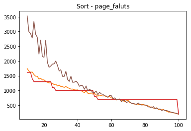
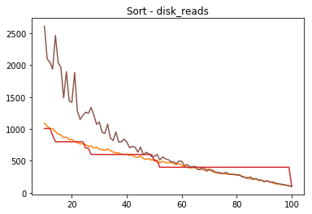
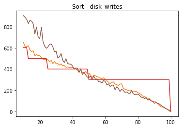
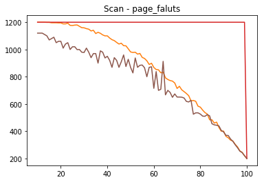
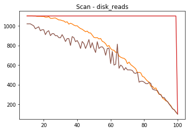
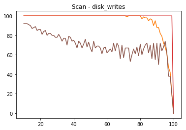
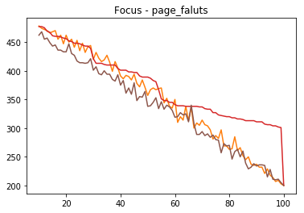
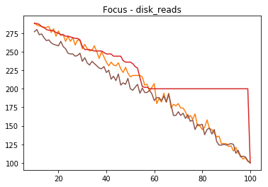
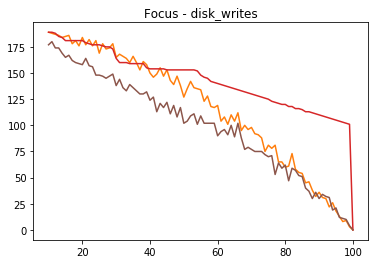

# Tarea 2 - Informe
> Pedro Ricci

Detalles de como funciona cada método en comentarios en el [main.c](main.c)
## Hipótesis
El algoritmo custom es una versión mejorada de FIFO.
Se espera que performe de igual o mejor manera. 
El algoritmo random debe ser mejor que FIFO, ya que FIFO reemplaza muchas veces la página que fue usada últimamente, lo que no es buena estrategia.
## Gráficos
Colores: 
### Sort
#### Faltas de página

#### Lecturas de disco

#### Escrituras en disco

### Scan
#### Faltas de página

#### Lecturas de disco

#### Escrituras en disco

### Focus
#### Faltas de página

#### Lecturas de disco

#### Escrituras en disco

